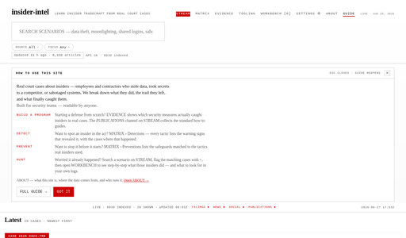

```
⠀⠀⠀⠀⠀⠀⠀⠀⠀⠀⠀⣠⡀
⠀⠀⠀⠀⠀⠀⠀⠀⠀⠀⢸⣳⣮⢆⠀⠀⠀⠀⠀⠀⠀⠀⠀⠀⠀⠀⠀⠀⠀⢀⡤⣒⡲⡄
⠀⠀⠀⠀⠀⠀⠀⠀⠀⠀⡹⣽⣿⡎⠣⡀⠀⠀⠀⠀⠀⠀⠀⠀⠀⠀⠀⠀⡤⣳⣿⣿⣷⠘⡄
⠀⠀⠀⠀⠀⠀⠀⠀⠀⠀⣇⡿⢿⣟⣤⣭⣶⣤⣄⣀⣀⣀⣀⣀⠀⢀⡤⣫⡾⣿⣿⣿⣿⡧⢳
⠀⠀⠀⠀⠀⠀⠀⠀⠀⣸⣸⣾⣿⣿⣿⣿⣿⣿⣿⣿⣿⣿⣿⣿⣯⡩⣾⢏⣾⡿⠋⠁⣻⣿⢸
⠀⠀⠀⠀⠀⠀⣀⣴⣾⣿⣿⣿⣿⣿⡿⣫⣿⣿⣿⣿⣿⣿⣿⣿⣿⣷⣆⣺⡿⠏⠁⢠⣿⡏⡎
⠀⠀⠀⠀⢀⣶⣿⣿⣿⢿⣟⣿⣿⡟⣵⣿⣿⣿⣿⣿⣿⣿⣿⣿⣿⣿⣿⣷⣥⡄⣶⣿⡛⣕⡅
⠀⠀⠀⠀⣾⣿⣿⣯⠖⠠⢹⣿⣿⣿⣿⣿⣿⣿⠿⠿⣿⣿⣿⣿⣿⣿⣿⣿⣿⣿⣿⡻⠉⢹⣷⡄
⠀⠀⠀⣸⣿⣿⣿⣮⣡⣠⣿⣿⣿⣿⣿⣟⠋⢴⡟⠀⠀⣙⣿⣿⣿⣿⣿⣿⣿⣿⣿⣿⡆⢸⣿⡦
⠀⠀⢠⣿⣿⣿⡿⢿⣾⣿⣿⣿⣿⣿⣿⣿⣶⣮⣵⣴⣴⣿⣿⣿⣿⣿⣿⣿⣿⣿⣿⣿⣿⣾⣿⡧
⠀⢀⣾⣿⣟⠀⠉⠐⠀⠈⢻⣿⣿⣿⣿⣿⣿⣿⣿⣿⣿⣿⣿⣿⣿⣿⣿⣿⣿⣿⣿⣿⣿⣿⣿⣿⡀
⢀⠰⣿⣾⣯⡈⠀⠀⠐⣰⣾⣿⢿⣿⣿⣿⣿⣿⣿⣿⣿⣿⣿⣿⣿⣿⣿⣿⣿⣿⣿⣿⡏⣾⣿⣿⣧⡀
⠀⠘⣿⣿⡿⡿⠦⠶⣿⣿⣯⣿⢯⣿⣿⣿⣿⣿⣿⣿⣿⣿⣿⣿⣿⣿⣿⣿⣿⣿⣿⠿⣨⣿⣿⣿⣿⣦
⠀⠀⢽⣿⣿⣷⣦⣀⣀⣈⣉⠛⢛⡛⣉⣩⣴⣿⣿⣿⣿⣿⣿⣿⣿⣿⣿⣿⣿⣿⠟⣵⣿⣿⣿⣿⣿⣿⡂
⠀⠀⠀⢻⣿⣿⣿⣿⣿⣿⣿⣿⣿⣿⣿⣿⣿⣿⣿⣿⣿⣿⣿⣿⣿⣿⣿⣿⣿⢝⣵⣿⣿⣿⣿⣿⣿⣿⡃
⠀⠀⠀⣰⣿⡻⣿⣿⣿⣿⣿⣿⣿⣿⣿⣿⣿⣿⣿⣿⣿⣿⣿⣿⣿⣿⣿⡛⣵⣿⣿⣿⣿⣿⣿⣿⣿⣿⡁
⠀⠀⢀⣿⣿⣿⣮⣻⡻⣿⣿⣿⣿⣿⣿⣿⣿⣿⣿⣿⣿⣿⣿⢿⣻⣿⣷⣿⣿⣿⣿⣿⣿⣿⣿⣿⣿⣿⣦
⠀⠀⢼⣿⣿⣿⣿⣿⣿⣮⣜⣛⢻⠻⠿⠿⣟⢿⣻⣿⣽⣾⣷⣿⣿⣿⣿⣿⣿⣿⣿⣿⣿⣿⣿⣿⣿⣿⡿
⠀⠀⣻⣿⣿⣿⣿⣿⣿⣿⣿⣿⣿⣿⣿⣿⣿⣿⣿⣿⣿⣿⣿⣿⣿⣿⣿⣿⣿⣿⣿⣿⣿⣿⣿⣿⣿⣿⣟
⠀⠀⢼⣿⣿⣿⣿⣿⣿⣿⣿⣿⣿⣿⣿⣿⣿⣿⣿⣿⣿⣿⣿⣿⣿⣿⣿⣿⣿⣿⣿⣿⣿⣿⣿⣿⣿⣿⣾⡄
⠀⣰⣿⣿⣿⣿⣿⣿⣿⣿⣿⣿⣿⣿⣿⣿⣿⣿⣿⣿⣿⣿⣿⣿⣿⣿⣿⣿⣿⣿⣿⣿⣿⣿⣿⣿⣿⣿⣿⣿⠄
⠀⣿⣿⣿⣿⣿⣿⣿⣿⣿⣿⣿⣿⣿⣿⣿⣿⣿⣿⣿⣿⣿⣿⣿⣿⣿⣿⣿⣿⣿⣿⣿⣿⣿⣿⣿⣿⣿⣿⣿⣇
```

wowe much cyber

Insider risk, [`DFIR`](https://en.wikipedia.org/wiki/Digital_forensics_and_incident_response), [`OSINT`](https://en.wikipedia.org/wiki/Open-source_intelligence). [`Python`](https://www.python.org/) + [`AWS`](https://aws.amazon.com/) / [`GCP`](https://cloud.google.com/).

I work in [`Massachusetts`](https://en.wikipedia.org/wiki/Massachusetts) for a large US [`financial services`](https://en.wikipedia.org/wiki/Financial_services) firm, building insider-threat and incident-response capability across cloud and enterprise environments.

[`AI`](https://en.wikipedia.org/wiki/Artificial_intelligence): [`DGX Spark`](https://www.nvidia.com/en-us/products/workstations/dgx-spark/), [`Claude`](https://www.anthropic.com/claude), [`Codex`](https://openai.com/codex/), [`Cursor`](https://cursor.com).

## Projects

### Shipped

<table>
  <tr>
    <td width="272" valign="middle">
      <a href="./assets/projects/full/insider-intel.jpg"></a>
    </td>
    <td valign="middle">
      <strong><a href="https://github.com/Scubber/insider-intel">insider-intel</a></strong><br>
      An open <a href="https://en.wikipedia.org/wiki/Open-source_intelligence"><code>OSINT</code></a> research instrument that turns litigated insider cases into corpus-level evidence: who commits these incidents, how they happen, and which records actually detect and convict them. Live at <a href="https://insider-intel.net">insider-intel.net</a>.
    </td>
  </tr>
</table>
