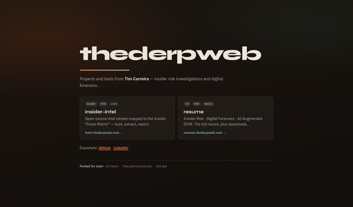
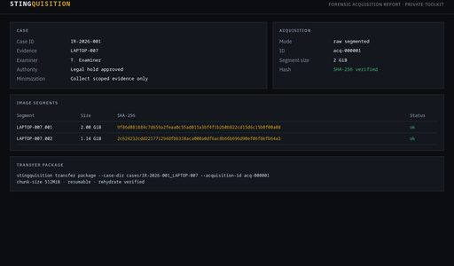
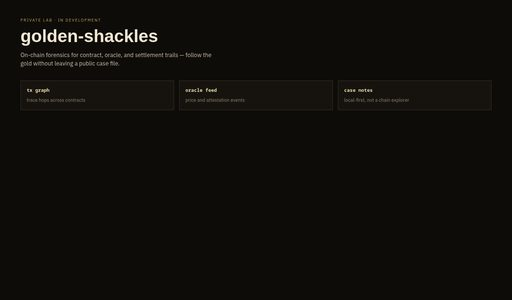

```
      ::::::::   ::::::::  :::    ::: :::::::::  :::::::::  :::::::::: :::::::::
    :+:    :+: :+:    :+: :+:    :+: :+:    :+: :+:    :+: :+:        :+:    :+:
   +:+        +:+        +:+    +:+ +:+    +:+ +:+    +:+ +:+        +:+    +:+
  +#++:++#++ +#+        +#+    +:+ +#++:++#+  +#++:++#+  +#++:++#   +#++:++#:
        +#+ +#+        +#+    +#+ +#+    +#+ +#+    +#+ +#+        +#+    +#+
#+#    #+# #+#    #+# #+#    #+# #+#    #+# #+#    #+# #+#        #+#    #+#
########   ########   ########  #########  #########  ########## ###    ###
```

wowe much cyber

I've spanned many job roles, most recently in Insider risk, [`DFIR`](https://en.wikipedia.org/wiki/Digital_forensics_and_incident_response), Cloud Security Engineering, Cloud Security Operations, and Digital Forensics and Incident Response. I build tools that interest me and maybe cover a niche area of underserved cybersecurity areas.

I mostly work for a large US [`financial services`](https://en.wikipedia.org/wiki/Financial_services) firms, building insider-threat and incident-response capability across cloud and enterprise environments.

## Projects

### Shipped

<table>
  <tr>
    <td width="272" valign="middle">
      <a href="./assets/projects/full/insider-intel.jpg"></a>
    </td>
    <td valign="middle">
      <strong><a href="https://github.com/Scubber/insider-intel">insider-intel</a></strong><br>
      An open <a href="https://en.wikipedia.org/wiki/Open-source_intelligence"><code>OSINT</code></a> research instrument that turns litigated insider cases into corpus-level evidence: who commits these incidents, how they happen, and which records actually detect and convict them. Live at <a href="https://insider-intel.net">insider-intel.net</a>.
    </td>
  </tr>
  <tr>
    <td width="272" valign="middle">
      <a href="./assets/projects/full/thederpweb.jpg"></a>
    </td>
    <td valign="middle">
      <strong><a href="https://thederpweb.com">thederpweb</a></strong><br>
      A labs hub for insider-risk and <a href="https://en.wikipedia.org/wiki/Digital_forensics_and_incident_response"><code>DFIR</code></a> tools — currently insider-intel and the resume, with more parked behind it. Live at <a href="https://thederpweb.com">thederpweb.com</a>.
    </td>
  </tr>
</table>

### In development

<table>
  <tr>
    <td width="272" valign="middle">
      <a href="./assets/projects/full/stingquisition.jpg"></a>
    </td>
    <td valign="middle">
      <strong>stingquisition</strong> · private repository<br>
      A portable forensic acquisition toolkit for insider-threat and <a href="https://en.wikipedia.org/wiki/Digital_forensics_and_incident_response"><code>DFIR</code></a> workflows: case folders, segmented raw imaging, SHA-256 verification, resumable transfer, and JSON/HTML reporting.
    </td>
  </tr>
  <tr>
    <td width="272" valign="middle">
      <a href="./assets/projects/full/tech-bleed.jpg"></a>
    </td>
    <td valign="middle">
      <strong>The Cyber Hound</strong> · private repository<br>
      Research into where tech jobs are going: H-1B labor-condition applications and WARN notices in the Hartford–Springfield corridor, turned into a public-records investigation.
    </td>
  </tr>
  <tr>
    <td width="272" valign="middle">
      <a href="./assets/projects/full/golden-shackles.jpg"></a>
    </td>
    <td valign="middle">
      <strong>golden-shackles</strong> · private repository<br>
      An on-chain forensics lab for contract, oracle, and settlement trails
    </td>
  </tr>
</table>
